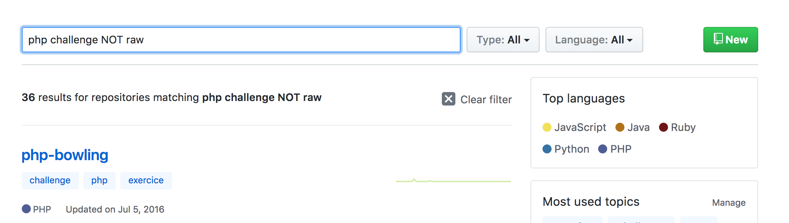
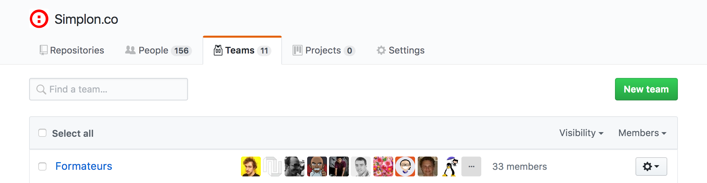
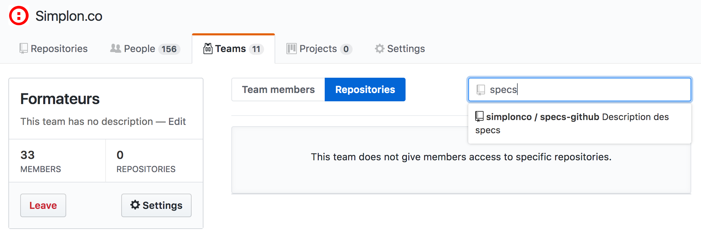

# Specs Github

Tu es formateur chez Simplon et ne sais pas comment utiliser efficacement l'organisation github ?
Ce guide est pour toi !

### Je cherche du contenu

L’organisation Simplon contient **500 repositories** couvrant beaucoup de sujets différents.

La plupart des repos suivent nos specs de **[nomenclature](https://github.com/simplonco/training/blob/master/CONTRIBUTING.md)** : {techno}-{format}-{nom} et github associe automatiquement un langage aux repos en les analysant.

Mais nous avons aussi un **système de tags**, qui te permet de faire des recherches plus poussée. Pour trouver ton bonheur tu peux t’aider de notre [index](https://github.com/simplonco/tag-index). Par exemple le tag **star** défini un repo bien documenté. Le tag **raw** défini un repo peu ou pas documenté. Le tag **pending** défini un repo en construction. Tu peux aussi chercher en utilisant plusieurs tags mais aussi en excluant certains grace au mot clé NOT.

### Je veux créer du contenu

1. Comment nommer mon projet ?
  	+ On t’invite à suivre le même format pour nommer tes projets que celui spécifié plus haut : {techno}-{format}-{nom}.
2. Comment taguer mon projet ?
	+ Avant toute chose, si ton repo est voué à évoluer tu peux le définir comme pending. C’est safe de mettre pending et/ou raw de base puis de les enlever quand le repo est complet.
	+ Tague ton projet afin de le rendre plus facilement accessible aux autres formateurs. Essaie d'utiliser un maximum de tags qui existent déjà. Si tu utilises un tag qui n'existe pas et que tu penses qu'il peut être utile à d'autres personnes dans l'organisation, n'hésite pas à forker et faire une pull-request sur le repo tag-index pour rajouter ce tag à la liste.
  
**exemple de nom** : php-challenge-chatroom

**exemples de tags** :  eval mysql socket

### Je veux inviter mes apprenants à créer du contenu

Afin de garder les repos communs cleans, fork les repos que tu comptes utiliser et sur lesquels tu souhaites faire participer tes apprenants. Ils pourront donc faire des pull-request sur ton fork.

Tu peux aussi utiliser le système de team et attribuer des repos à ta team.

1. Les teams simplon.

2. Ajouter un repo à votre team

